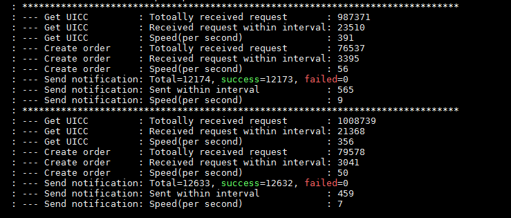
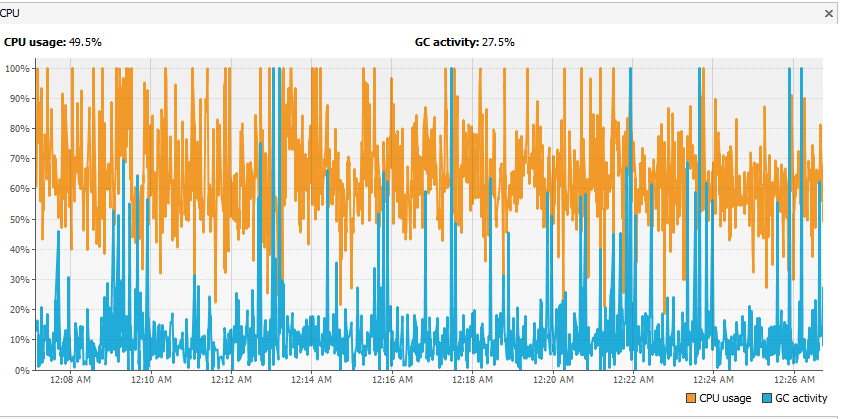
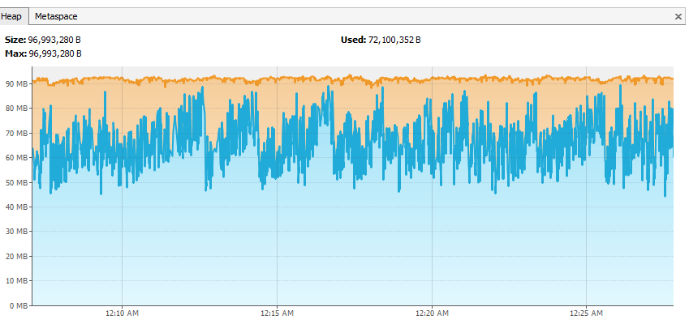
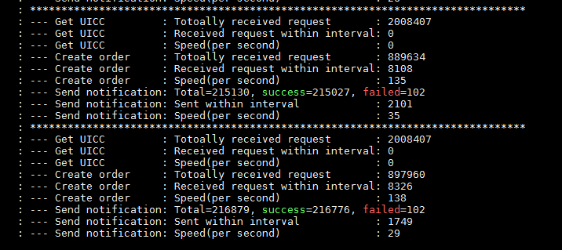
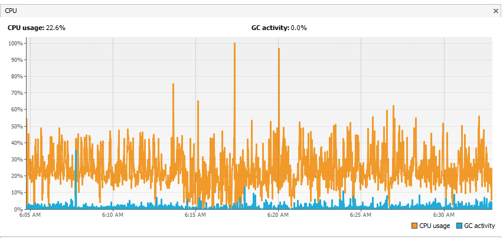
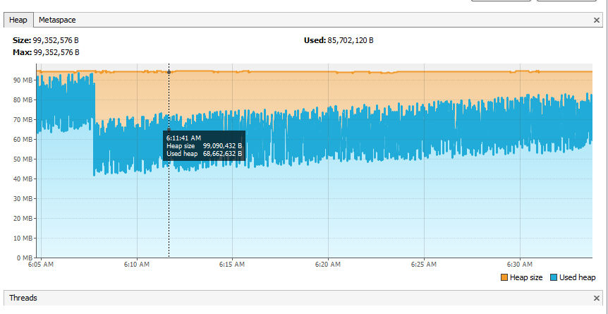
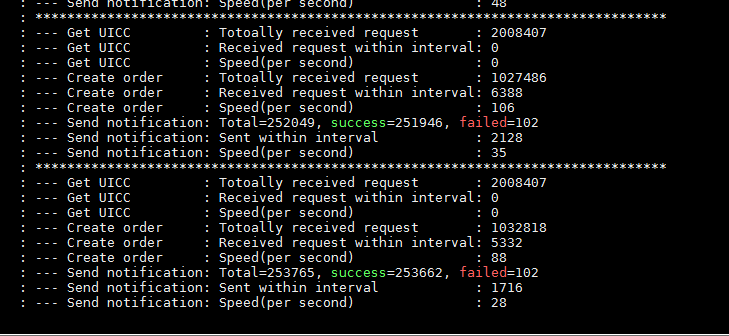
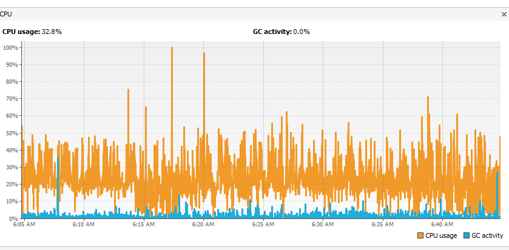
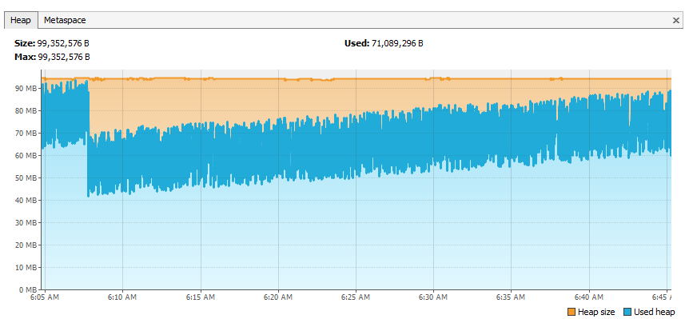
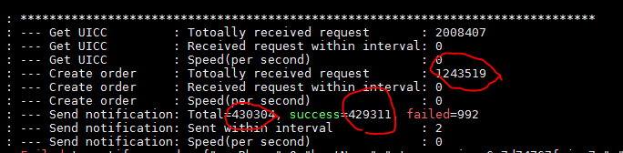

# Multi Pod Issue

## Millisecond is not enough

There is a situation that pod will generate the same record, except sequence id

This will always, trigger the delete for all TPE, by the late POD.

Once deleted, there is a delay, for 1 s for the late POD.

However, since the late pod delete the TPE, while the early POD on half way of processing, then, there is a chance that, the target processing is not proceeding, as TPE does not exist anymore. The chance that the update time is same are high.

`Example record`

| Pod                                  | Update Time   | Sequence ID                          |
| ------------------------------------ | ------------- | ------------------------------------ |
| 8b69b160-0642-11eb-82a3-a77ba734f64b | 1601816844307 | 8b81a630-0642-11eb-82a3-a77ba734f64b |
| 8b7411a0-0642-11eb-82a3-a77ba734f64b | 1601816844310 | 8b821b60-0642-11eb-82a3-a77ba734f64b |

Simple fixes

- Change the update time data type from long to `timeuuid`
- In a situation where the several TPE with the same paging state has the same update time, then add the extra comparison with the `sequence id`

`TargetPodExecutionManagerImpl#checkIfDuplicateExistsAndRetractWhenNecessary`

> The comparing on time upto millisecond is not sufficient.
> Lets try to compare the sequence ID which is time uuid which a timestamp up to nano seconds
> The late pod should delete its own pod execution record

```java
if (tpe.getUpdateTime() > earliestCheckIn || tpe.getSequenceId().timestamp() > earliestSeqId) {
    deleteTargetPodExecution(tpe);
    LOGGER.debug("Current Target Execution Pod is deleted because an older one is already created.")
    .details("deleted", tpe)
    .details("current_pod", podID.toString())
    .details("curr_seq_id", tpe.getSequenceId().timestamp())
    .details("other_seq_id", earliestSeqId)
    .build();
    return true;
} else {
/**
* This is the case where the current pod is the early pod, where it only see 1
* record in the TPE table, which is its own TPE
* Should get only one record which is the smaller sequence id
* Basically no delete will be done
*/
List<TargetPodExecutionEntity> tpesWithExactCheckinTime = targetsWithSamePagingState.stream()
.filter(t -> t.getSequenceId().timestamp() == earliestSeqId)
.collect(Collectors.toList());
if (targetsWithSamePagingState.size() == 1) {
  LOGGER.debug("Current Target Execution Pod is OK to proceed.")
  .details("tpe", tpesWithExactCheckinTime)
  .details("current_pod", podID.toString())
  .details("tpe_pod_id", tpe.getPodId().toString())
  .details("curr_seq_id", tpe.getSequenceId().timestamp())
  .details("other_seq_id", earliestSeqId)
  .build();
 }
}
```

## Protecting the worker

> Basically to limit the number of campaign processed at one cycle

## Processing in New Design

> The volumetric is not expected high. Since pages are processed sequentially one after another. The record for one campaign will not be added until the new page is started for processing

```sql
CREATE TABLE IF NOT exists ota_campaign_targets_pod_distribution (
    campaign_id timeuuid,
    pod_id timeuuid,
    execution_step ascii,
    created_paging_state ascii,
    pending_paging_state ascii,
    state ascii,
    update_time bigint,
    PRIMARY KEY (campaign_id)
) WITH comment = 'This table is to store information on which pods are processing which campaign Page ID';
```

`Example Data`

| campaign_id | pod_id | execution_step | created_paging_state | pending_paging_state | state | update_time |
| ----------- | ------ | -------------- | -------------------- | -------------------- | ----- | ----------- |


## Pod List

`Pod label`
kubectl get pods -l app.kubernetes.io/instance=ota-campaign

```text
NAME                            READY   STATUS    RESTARTS   AGE
ota-campaign-6c7d74767f-c9fcb   1/1     Running   3          5h39m
ota-campaign-6c7d74767f-dlxbc   1/1     Running   3          11h
ota-campaign-6c7d74767f-jqr7q   1/1     Running   3          5h39m
ota-campaign-6c7d74767f-mzrzd   1/1     Running   3          11h
ota-campaign-6c7d74767f-sll5t   1/1     Running   3          5h39m
```

forwarding the log

```text
C:\apps\campaignbench>kubectl logs --follow ota-campaign-6c7d74767f-c9fcb > ota-campaign-6c7d74767f-c9fcb.log
C:\apps\campaignbench>kubectl logs --follow ota-campaign-6c7d74767f-dlxbc > ota-campaign-6c7d74767f-dlxbc.log
C:\apps\campaignbench>kubectl logs --follow ota-campaign-6c7d74767f-jqr7q > ota-campaign-6c7d74767f-jqr7q.log
C:\apps\campaignbench>kubectl logs --follow ota-campaign-6c7d74767f-mzrzd > ota-campaign-6c7d74767f-mzrzd.log
C:\apps\campaignbench>kubectl logs --follow ota-campaign-6c7d74767f-sll5t > ota-campaign-6c7d74767f-sll5t.log
```

`truncate table`

```text
source 'C:\apps\campaignbench\tables.cql';
```

`jmx`

```shell
kubectl port-forward services/ota-campaign 30984:30984
```

# Bench

## Strategy

The bench should cover some extreme situation.

- How the increasing number of pod helps to speed up the target consumption

  `More pod less time to process`

  | #Pod | #Campaign | #Target Each | Completed within | Comment                                                                                                                                                       |
  | ---- | --------- | ------------ | ---------------- | ------------------------------------------------------------------------------------------------------------------------------------------------------------- |
  | 2    | 1         | N            |                  | second fastest since it is only one campaign                                                                                                                  |
  | 5    | 1         | N            |                  | the fastest since only one campaign and processed by biggest number of pod                                                                                    |
  | 1    | 1         | N            |                  | second lowest, since it is one campaign and processed by only one pod                                                                                         |
  | 1    | 2         | N/2          |                  | the slowest,since it is two campaign, one campaign will be prioritized, the second will be processed. Switching to second campaign may be additional overhead |

## Preparation

- Data

- Setup

  `Deployment Definition`

  ```yaml
  apiVersion: apps/v1
  kind: Deployment
  metadata:
  annotations:
    deployment.kubernetes.io/revision: "1"
  creationTimestamp: "2020-10-08T03:54:38Z"
  generation: 1
  labels:
    app.kubernetes.io/instance: ota-campaign
    app.kubernetes.io/managed-by: Tiller
    app.kubernetes.io/name: ota-campaign
    app.kubernetes.io/version: 7.6.0-SNAPSHOT
    helm.sh/chart: ota-campaign-7.6.0-SNAPSHOT
  name: ota-campaign
  namespace: default
  resourceVersion: "53331"
  selfLink: /apis/apps/v1/namespaces/default/deployments/ota-campaign
  uid: 9126d93c-037c-4725-82e4-bb94ce7ba12c
  spec:
  progressDeadlineSeconds: 600
  replicas: 5
  revisionHistoryLimit: 10
  selector:
    matchLabels:
      app.kubernetes.io/instance: ota-campaign
      app.kubernetes.io/name: ota-campaign
  strategy:
    rollingUpdate:
      maxSurge: 1
      maxUnavailable: 0
    type: RollingUpdate
  template:
    metadata:
      annotations:
        checksum/config: 666f9518c7c90c326fa26d4ff86ac3c6e402f38353c3461ca8eda04aced88e49
      creationTimestamp: null
      labels:
        app.kubernetes.io/instance: ota-campaign
        app.kubernetes.io/name: ota-campaign
    spec:
      affinity: {}
      containers:
        - args:
            - jpda
            - run
          env:
            - name: KUBERNETES_NAMESPACE
              valueFrom:
                fieldRef:
                  apiVersion: v1
                  fieldPath: metadata.namespace
            - name: CATALINA_OPTS
              value:
                -Xss256k -Xms32m -Xmx96m -XX:ParallelGCThreads=1 -XX:+PerfDisableSharedMem
                -XX:+UseParallelOldGC -XX:CICompilerCount=2 -XX:NativeMemoryTracking=summary
                -XX:OnOutOfMemoryError="printf '{\"v\":\"1.1.1\",\"category\":\"SERVICE\",\"level\":\"FATAL\",\"timestamp\":\"%s\",\"application\":{\"name\":\"%s\",\"version\":\"%s\",\"component\":\"OutOfMemory\",\"thread\":\"localhost-startStop-1\",\"instanceId\":\"%s\",\"process\":\"%s\"},\"details\":{\"type\":\"INTERNAL\",\"description\":\"Out
                of memory error\"}}\n' $(date +%Y-%m-%d-T%T.999Z) ota-campaign 7.6.0-SNAPSHOT
                $(hostname) %p" -XX:+ExitOnOutOfMemoryError -DAsyncLoggerConfig.RingBufferSize=32768
            - name: JAVA_OPTS
              value:
                -Dlog4j.configurationFile=/opt/gemalto/etc/webapp/log4j2.yaml -javaagent:/opt/gemalto/lib/org.jacoco.agent-runtime.jar=output=tcpserver,address=*,includes=com.gemalto.*
                -Dcom.sun.management.jmxremote.port=30984 -Dcom.sun.management.jmxremote.local.only=false
                -Dcom.sun.management.jmxremote.authenticate=false -Dcom.sun.management.jmxremote.ssl=false
                -Dcom.sun.management.jmxremote.rmi.port=30984 -Djava.rmi.server.hostname=localhost
                -XX:NativeMemoryTracking=summary
            - name: JPDA_ADDRESS
              value: 0.0.0.0:8000
          image: dockerhub.gemalto.com/ota-cloud/ota-campaign:7.6.0-SNAPSHOT
          imagePullPolicy: IfNotPresent
          livenessProbe:
            failureThreshold: 3
            httpGet:
              path: /liveness
              port: 8080
              scheme: HTTP
            initialDelaySeconds: 30
            periodSeconds: 30
            successThreshold: 1
            timeoutSeconds: 30
          name: ota-campaign
          ports:
            - containerPort: 8080
              name: web
              protocol: TCP
            - containerPort: 8085
              name: metrics
              protocol: TCP
            - containerPort: 6300
              name: jacoco
              protocol: TCP
            - containerPort: 8000
              name: remote-debug
              protocol: TCP
            - containerPort: 30984
              name: jmx
              protocol: TCP
          readinessProbe:
            failureThreshold: 3
            httpGet:
              path: /readiness
              port: 8080
              scheme: HTTP
            initialDelaySeconds: 15
            periodSeconds: 10
            successThreshold: 1
            timeoutSeconds: 1
          resources:
            limits:
              memory: 512Mi
            requests:
              cpu: 100m
              memory: 190Mi
          terminationMessagePath: /dev/termination-log
          terminationMessagePolicy: File
          volumeMounts:
            - mountPath: /opt/gemalto/etc/webapp
              name: configuration
      dnsPolicy: ClusterFirst
      imagePullSecrets:
        - name: dockerhub-gemalto
      initContainers:
        - command:
            - sh
            - /opt/gemalto/tools/secretlink.sh
            - /opt/gemalto/etc/configmap
            - /opt/gemalto/etc/secrets
            - /opt/gemalto/etc/webapp
          image: dockerhub.gemalto.com/ota-cloud/deployment-tools:1.0.1_build.17
          imagePullPolicy: IfNotPresent
          name: secretlink
          resources: {}
          terminationMessagePath: /dev/termination-log
          terminationMessagePolicy: File
          volumeMounts:
            - mountPath: /opt/gemalto/etc/secrets/cassandra
              name: cassandra
            - mountPath: /opt/gemalto/etc/configmap
              name: configmap
            - mountPath: /opt/gemalto/etc/webapp
              name: configuration
      restartPolicy: Always
      schedulerName: default-scheduler
      securityContext: {}
      terminationGracePeriodSeconds: 30
      volumes:
        - configMap:
            defaultMode: 420
            name: ota-campaign
          name: configmap
        - name: cassandra
          secret:
            defaultMode: 420
            secretName: login.cassandra
        - emptyDir: {}
          name: configuration
  status:
  availableReplicas: 2
  conditions:
    - lastTransitionTime: "2020-10-08T03:55:06Z"
      lastUpdateTime: "2020-10-08T03:55:06Z"
      message: Deployment has minimum availability.
      reason: MinimumReplicasAvailable
      status: "True"
      type: Available
    - lastTransitionTime: "2020-10-08T03:54:38Z"
      lastUpdateTime: "2020-10-08T03:55:06Z"
      message: ReplicaSet "ota-campaign-6c7d74767f" has successfully progressed.
      reason: NewReplicaSetAvailable
      status: "True"
      type: Progressing
  observedGeneration: 1
  readyReplicas: 2
  replicas: 2
  updatedReplicas: 2

  ```

`ConfigMap`

```yaml
apiVersion: v1
data:
  application.yaml: |
    #@formatter:off
    services:
        otaPull:
            protocol: http
            host: 192.168.0.171
            port: 9090
        otaPush:
            protocol: http
            host: 192.168.0.171
            port: 9090
        otaCards:
            protocol: http
            host: 192.168.0.171
            port: 9090

    settings:
        #bearer selector configuration
        bearerSelector:
            PollingDateEnable: true
            PollingDateThreshold: 45
            DataSizeEnable: true
            DataSizeLimit: 500
        dataSizeCache:
            DataSizeCacheTTL: 60
            DataSizeCacheWeightSize: 5000

        #TTL of target records after reaching final state in minutes. Default to 1 day first
        targetDatabaseTTL: 1440

        #Interval to compute the bucket id in milliseconds. Default to 30mins. Current possible values are 900000 (QuarterHr), 1800000 (HalfHr), 3600000 (Hr).
        #Note that this interval should be less than or equal to cpgStatsAggInterval.
        cpgStatsBucketInterval: 1800000
        #Interval to perform stats aggregate computation for campaigns in milliseconds. Default to 30mins. Current possible values are 1800000 (HalfHr), 3600000 (Hr).
        cpgStatsAggInterval: 1800000
        #Delay from agg interval to start agg compute in milliseconds. Default to 2mins.
        cpgStatsAggComputeDelay: 120000

        #Interval in seconds to check and perform criteria targets generation if needed. Default to 60secs
        criteriaTargetsInterval: 10
        #No of iccids to get and evaluate for one batch from ota cards
        criteriaTargetsEvalCardsFetchBatchSize: 2000
        #Flush size that indicates how many iccids to write to db at one time from ota cards
        criteriaTargetsEvalCardsFlushSize: 500
        #No of concurrent evaluation of each iccid (card and profile info) against criteria
        criteriaTargetsEvalCardsConcurrentEvalSize: 5
        #Flush size that indicates how many iccids to write to db at one time from bfs
        criteriaTargetsBfsFlushSize: 500
        #TTL to store targets and targets status temporarily for evaluation for criteria (in secs). Defaults to 12hrs.
        criteriaTargetsTempStorageTtl: 43200

        #Determine how many records are to be retrieved from the campaign target table at a time.
        targetsFetchForReportBatchSize: 20
        #Flush size that indicates how many report items to write to db at one time from bfs
        reportBfsFlushSize: 10
        #Maximum number of concurrent report generations.
        maxNumberOfConcurrentReportGeneration: 5
        #Interval period between retrieval of Campaign Report
        reportRetrievalPeriod: 5
        #This delay is meant only to facilitate testing verification. The unit is in seconds. It should be 0 in Production.
        initialReportGenerationDelayForTesting: 5

        #Update interval to maintain app instance alive status (seconds)
        appInstanceKeepAliveInterval: 60
        #No of update intervals missed before identify an app instance as dead
        appInstanceNumIntervalsIdentifyInvalid: 2
        #Identifier for group of app instances
        appInstanceGroupId: 1

        #Duration to hold the lease for processing batches of campaign targets and creating orders exclusive by a pod in seconds.
        cpgTargetsObjectLeaseDuration: 600
        #Waiting duration in seconds when there is nothing to process.
        cpgTargetsExecutionDelayWhenIdle: [2,4]
        #Waiting duration in seconds when proxy (ota-push, ota-pull, etc.) is not reachable.
        cpgTargetsExecutionDelayWhenProxyTimeout: [2]
        #The maximum number of times when proxy (ota-push, ota-pull, etc.) is not reachable.
        cpgTargetsExecutionMaxRetryWhenProxyTimeout: 3
        #The maximum number of targets fetched from the database in every batch.
        cpgTargetsBatchSize: 20
        #The maximum duration in seconds given to either ota-pull or ota-push to process one whole batch of targets.
        batchOrderCreationTimeout: 20

        instanceKeepAliveTime: 1500

        maxCursorBlockSize: 1
        #The interval in seconds on how often ota-campaign re-evaluates the state of each campaign.
        campaignLifeCycleInterval: 10

        #targetlist_timer_period: timer period for target list generator which is given in minutes
        readingTimerPeriod: 1
        #targetlist_timer_delay: delay before the first attempt due given in minutes
        readingTimerDelay: 1
        # ExpiredDataCleanupJob execution period, unit millisecond
        expiredDataCleanupPeriod: 86400000


        #call ota-cards for non Iccid target creation in batch
        otaCardsTargetIdTypeNonIccidBatchSize: 50

        orderProxyHttpConfig:
            connectTimeoutMs: 60000
            connectionRequestTimeoutMs: 60000
            socketTimeoutMs: 60000
            dispatcherThreadCount: 2
            poolingConnectionManagerMaxTotal: 20
            poolingConnectionManagerDefaultMaxPerRoute: 5

        cassandraBigFileStorage:
            TARGET_LIST:
                enableUniqueFilename: true
                maxPayloadSize: 524288
                maxBlockSize: 52428800
                dbBlocksFetchSize: 20
                dbRemainingBlocksPrefetchThreshold: 2
                maxParallelDbRequestsPerFile: 50
                fileDbStoreRequestTimeout: 300
                waitFileDbStoreTimeout: 1200
                fileContentConfigurations:
                    - extension: target
                      maxFileDataSize: 2147483648
                      ignoreCase: false
                      noFooter: true
                      entityEnd: "\n"
                      headerLines: 2
            REPORT:
                enableUniqueFilename: true
                maxPayloadSize: 524288
                maxBlockSize: 52428800
                dbBlocksFetchSize: 20
                dbRemainingBlocksPrefetchThreshold: 2
                maxParallelDbRequestsPerFile: 50
                fileDbStoreRequestTimeout: 300
                waitFileDbStoreTimeout: 1200
                fileContentConfigurations:
                    - extension: rpt
                      maxFileDataSize: 2147483648
                      ignoreCase: false
                      noFooter: true
                      entityEnd: "\n"
                      headerLines: 15
  application.yaml.orig: |+
    #@formatter:off
    services:
        otaPull:
            protocol: http
            host: 192.168.0.171
            port: 9090

    settings:
        #period: timer period for campaign life cycle to check if is given in minutes
        lifecycle_timer_period: 1
        #TTL of target records after reaching final state in minutes. Default to 1 day first
        targetDatabaseTTL: 1440
        #Interval to compute the bucket id in milliseconds. Default to 1 hr first
        targetHistoryBucketInterval: 3600000
        # callback URL, used by ota-pull to send back the campaign final result
        callbackUrl: http://ota-campaign:80/v1/targets/notifications

        instanceKeepAliveTime: 1500

        maxCursorBlockSize: 1

        batchSize: 2
        #targetlist_timer_period: timer period for target list generator which is given in minutes
        readingTimerPeriod: 2
        #targetlist_timer_delay: delay before the first attempt due given in minutes
        readingTimerDelay: 1

        cassandraBigFileStorage:
            enableUniqueFilename: true
            maxPayloadSize: 524288
            maxBlockSize: 52428800
            dbBlocksFetchSize: 20
            dbRemainingBlocksPrefetchThreshold: 2
            maxParallelDbRequestsPerFile: 50
            fileDbStoreRequestTimeout: 300
            waitFileDbStoreTimeout: 1200
            fileContentConfigurations:
                - extension: target
                  maxFileDataSize: 2147483648
                  ignoreCase: false
                  noFooter: true
                  entityEnd: "\n"
                  headerLines: 2


  features.properties: development=true
  log4j2.yaml: |-
    #@formatter:off
    Configuration:
        status: warn
        packages: com.gemalto.rnd.logging.ulf.plugins
        Properties:
            Property:
                - name: httpRequestBodyAllowedLogLevels
                  value: all
                - name: httpResponseBodyAllowedLogLevels
                  value: all
                - name: httpULFBodyFormat
                  value: raw
                - name: httpRemoveHeaders
                  value: Vnd-Gemalto-Com-Log-Context,Vnd-Gemalto-Com-Log-CorrelationId,Vnd-Gemalto-Com-Log-SessionId,ssl_client_cert,authorization,ssl_session_id

        Appenders:
            Console:
                name: Console
                target: SYSTEM_OUT
                UnifiedLogFormatLayout:
                    LayoutConfig:
                        - Selector:
                              Levels:
                                  equalsBelow: warn
                              CommunicationHttp:
                                  flow: out
                          Exclusions:
                              excludeAll: true
                        - Selector:
                              Levels:
                                  equalsBelow: info
                              CommunicationHttp:
                                  flow: in
                          Exclusions:
                              Exclusion:
                                  - value: details.request.body
                                  - value: details.response.body

        Loggers:
            AsyncRoot:
                level: INFO
                AppenderRef:
                    - ref: Console
            AsyncLogger:
                # -----------------------------------------------------------------------------------------
                # Application Levels
                # -----------------------------------------------------------------------------------------
                - name: com.gemalto
                  level: info
                - name: com.gemalto.telecom.ota.campaign.job.targets
                  level: info
                - name: com.gemalto.telecom.components.notification.dao.HttpNotificationDao
                  level: info
                - name: com.datastax
                  level: warn
                - name: com.networknt.schema
                  level: info

                # -----------------------------------------------------------------------------------------
                # TomEE Levels
                # -----------------------------------------------------------------------------------------
                - name: org.apache.catalina
                  level: INFO
                - name: org.apache.tomcat
                  level: INFO
                - name: org.apache.coyote.http2
                  level: WARN
                - name: org.apache.jasper.compiler.TldLocationsCache
                  level: WARN
                - name: OpenEJB
                  level: WARN
                - name: OpenEJB.options
                  level: WARN
                - name: OpenEJB.server
                  level: WARN
                - name: OpenEJB.cdi
                  level: WARN
                - name: OpenEJB.startup
                  level: WARN
                - name: OpenEJB.startup.service
                  level: WARN
                - name: OpenEJB.startup.config
                  level: WARN
                - name: OpenEJB.hsql
                  level: WARN
                - name: CORBA-Adapter
                  level: WARN
                - name: Transaction
                  level: WARN
                - name: org.apache.activemq
                  level: WARN
                - name: org.apache.geronimo
                  level: WARN
                - name: openjpa
                  level: WARN
                - name: org.apache.webbeans
                  level: WARN
                - name: org.apache.openejb
                  level: WARN
                - name: org.apache.naming
                  level: WARN
  persistence.yaml: |
    #@formatter:off
    engine:
      persistenceConnection: com.gemalto.telecom.components.connectors.cassandra.CassandraConnection

    dao:
      type: cassandra
      executionStatusTableName: ota_campaign_execution_statuses
      executionStatusByOrderTableName: ota_campaign_execution_statuses_by_order
      statusDetailMetadataTableName: ota_campaign_status_metadata

    consistencyLevels:
      # default CL for session
      session: LOCAL_QUORUM
      sessionSerial: LOCAL_SERIAL
      # CL per query (table and action)
      createAny: LOCAL_QUORUM
      updateAny: LOCAL_QUORUM
      getAny: LOCAL_QUORUM
      deleteAny: LOCAL_QUORUM

    cluster:
      user: !secretlink/cassandra/user/
      password: !secretlink/cassandra/password/
      contactPoints: 192.168.0.171
      port: 9042
      keyspaceName: ota_campaign
      keyspacePrefix: dev
      heartbeatIntervalSec: 30
      baseReconnectionIntervalSec: 1
      maxReconnectionIntervalSec: 64
      enableTracing: false
  server.xml:
    "<?xml version=\"1.0\" encoding=\"UTF-8\"?>\r\n<!--\r\n  Licensed to
    the Apache Software Foundation (ASF) under one or more\r\n  contributor license
    agreements.  See the NOTICE file distributed with\r\n  this work for additional
    information regarding copyright ownership.\r\n  The ASF licenses this file to
    You under the Apache License, Version 2.0\r\n  (the \"License\"); you may not
    use this file except in compliance with\r\n  the License.  You may obtain a copy
    of the License at\r\n\r\n      http://www.apache.org/licenses/LICENSE-2.0\r\n\r\n
    \ Unless required by applicable law or agreed to in writing, software\r\n  distributed
    under the License is distributed on an \"AS IS\" BASIS,\r\n  WITHOUT WARRANTIES
    OR CONDITIONS OF ANY KIND, either express or implied.\r\n  See the License for
    the specific language governing permissions and\r\n  limitations under the License.\r\n-->\r\n<!--
    Note:  A \"Server\" is not itself a \"Container\", so you may not\r\n     define
    subcomponents such as \"Valves\" at this level.\r\n     Documentation at /docs/config/server.html\r\n
    -->\r\n<Server port=\"8005\" shutdown=\"SHUTDOWN\">\r\n    <!-- TomEE plugin for
    Tomcat -->\r\n    <Listener className=\"org.apache.tomee.catalina.ServerListener\"/>\r\n
    \   <Listener className=\"org.apache.catalina.startup.VersionLoggerListener\"/>\r\n
    \   <!-- Security listener. Documentation at /docs/config/listeners.html\r\n    <Listener
    className=\"org.apache.catalina.security.SecurityListener\" />\r\n    -->\r\n
    \   <!--APR library loader. Documentation at /docs/apr.html -->\r\n    <!--Listener
    className=\"org.apache.catalina.core.AprLifecycleListener\" SSLEngine=\"on\" /-->\r\n
    \   <!-- Prevent memory leaks due to use of particular java/javax APIs-->\r\n
    \   <Listener className=\"org.apache.catalina.core.JreMemoryLeakPreventionListener\"/>\r\n
    \   <Listener className=\"org.apache.catalina.mbeans.GlobalResourcesLifecycleListener\"/>\r\n
    \   <Listener className=\"org.apache.catalina.core.ThreadLocalLeakPreventionListener\"/>\r\n\r\n
    \   <!-- Global JNDI resources\r\n         Documentation at /docs/jndi-resources-howto.html\r\n
    \   -->\r\n    <!--GlobalNamingResources-->\r\n    <!-- Editable user database
    that can also be used by\r\n         UserDatabaseRealm to authenticate users\r\n
    \   -->\r\n    <!--Resource name=\"UserDatabase\" auth=\"Container\"\r\n      type=\"org.apache.catalina.UserDatabase\"\r\n
    \     description=\"User database that can be updated and saved\"\r\n      factory=\"org.apache.catalina.users.MemoryUserDatabaseFactory\"\r\n
    \     pathname=\"conf/tomcat-users.xml\" />\r\n  </GlobalNamingResources-->\r\n\r\n
    \   <!-- A \"Service\" is a collection of one or more \"Connectors\" that share\r\n
    \        a single \"Container\" Note:  A \"Service\" is not itself a \"Container\",\r\n
    \        so you may not define subcomponents such as \"Valves\" at this level.\r\n
    \        Documentation at /docs/config/service.html\r\n     -->\r\n    <Service
    name=\"Catalina\">\r\n\r\n        <!--The connectors can use a shared executor,
    you can define one or more named thread pools-->\r\n        <!--\r\n        <Executor
    name=\"tomcatThreadPool\" namePrefix=\"catalina-exec-\"\r\n            maxThreads=\"150\"
    minSpareThreads=\"4\"/>\r\n        -->\r\n        <!-- Executor dedicated for
    µService execution -->\r\n        <Executor maxThreads=\"8\" minSpareThreads=\"8\"\r\n
    \           name=\"serviceThreadPool\" namePrefix=\"service-\" prestartminSpareThreads=\"true\"/>\r\n\r\n
    \       <!-- Executor dedicated for µService monitoring -->\r\n        <Executor
    maxThreads=\"2\" minSpareThreads=\"2\"\r\n            name=\"metricsThreadPool\"
    namePrefix=\"metrics-\" prestartminSpareThreads=\"true\"/>\r\n\r\n        <!--
    A \"Connector\" represents an endpoint by which requests are received\r\n             and
    responses are returned. Documentation at :\r\n             Java HTTP Connector:
    /docs/config/http.html\r\n             Java AJP  Connector: /docs/config/ajp.html\r\n
    \            APR (HTTP/AJP) Connector: /docs/apr.html\r\n             Define a
    non-SSL/TLS HTTP/1.1 Connector on port 8080\r\n        -->\r\n        <Connector
    connectionTimeout=\"20000\" executor=\"serviceThreadPool\" port=\"8080\"\r\n            protocol=\"HTTP/1.1\"\r\n
    \           redirectPort=\"8443\" server=\"Apache TomEE\" xpoweredBy=\"false\"/>\r\n\r\n
    \       <Connector connectionTimeout=\"20000\" executor=\"metricsThreadPool\"
    port=\"8085\"\r\n            protocol=\"HTTP/1.1\"\r\n            redirectPort=\"8443\"
    server=\"Apache TomEE\" xpoweredBy=\"false\"/>\r\n\r\n        <!-- A \"Connector\"
    using the shared thread pool-->\r\n        <!--\r\n        <Connector executor=\"tomcatThreadPool\"\r\n
    \                  port=\"8080\" protocol=\"HTTP/1.1\"\r\n                   connectionTimeout=\"20000\"\r\n
    \                  redirectPort=\"8443\" />\r\n        -->\r\n        <!-- Define
    a SSL/TLS HTTP/1.1 Connector on port 8443\r\n             This connector uses
    the NIO implementation. The default\r\n             SSLImplementation will depend
    on the presence of the APR/native\r\n             library and the useOpenSSL attribute
    of the\r\n             AprLifecycleListener.\r\n             Either JSSE or OpenSSL
    style configuration may be used regardless of\r\n             the SSLImplementation
    selected. JSSE style configuration is used below.\r\n        -->\r\n        <!--\r\n
    \       <Connector port=\"8443\" protocol=\"org.apache.coyote.http11.Http11NioProtocol\"\r\n
    \                  maxThreads=\"150\" SSLEnabled=\"true\">\r\n            <SSLHostConfig>\r\n
    \               <Certificate certificateKeystoreFile=\"conf/localhost-rsa.jks\"\r\n
    \                            type=\"RSA\" xpoweredBy=\"false\" server=\"Apache
    TomEE\" />\r\n            </SSLHostConfig>\r\n        </Connector>\r\n        -->\r\n
    \       <!-- Define a SSL/TLS HTTP/1.1 Connector on port 8443 with HTTP/2\r\n
    \            This connector uses the APR/native implementation which always uses\r\n
    \            OpenSSL for TLS.\r\n             Either JSSE or OpenSSL style configuration
    may be used. OpenSSL style\r\n             configuration is used below.\r\n        -->\r\n
    \       <!--\r\n        <Connector port=\"8443\" protocol=\"org.apache.coyote.http11.Http11AprProtocol\"\r\n
    \                  maxThreads=\"150\" SSLEnabled=\"true\" >\r\n            <UpgradeProtocol
    className=\"org.apache.coyote.http2.Http2Protocol\" xpoweredBy=\"false\" server=\"Apache
    TomEE\" />\r\n            <SSLHostConfig>\r\n                <Certificate certificateKeyFile=\"conf/localhost-rsa-key.pem\"\r\n
    \                            certificateFile=\"conf/localhost-rsa-cert.pem\"\r\n
    \                            certificateChainFile=\"conf/localhost-rsa-chain.pem\"\r\n
    \                            type=\"RSA\" />\r\n            </SSLHostConfig>\r\n
    \       </Connector>\r\n        -->\r\n\r\n        <!-- Define an AJP 1.3 Connector
    on port 8009 -->\r\n        <!--Connector port=\"8009\" protocol=\"AJP/1.3\" redirectPort=\"8443\"
    /-->\r\n\r\n\r\n        <!-- An Engine represents the entry point (within Catalina)
    that processes\r\n             every request.  The Engine implementation for Tomcat
    stand alone\r\n             analyzes the HTTP headers included with the request,
    and passes them\r\n             on to the appropriate Host (virtual host).\r\n
    \            Documentation at /docs/config/engine.html -->\r\n\r\n        <!--
    You should set jvmRoute to support load-balancing via AJP ie :\r\n        <Engine
    name=\"Catalina\" defaultHost=\"localhost\" jvmRoute=\"jvm1\">\r\n        -->\r\n
    \       <Engine defaultHost=\"localhost\" name=\"Catalina\">\r\n\r\n            <!--For
    clustering, please take a look at documentation at:\r\n                /docs/cluster-howto.html
    \ (simple how to)\r\n                /docs/config/cluster.html (reference documentation)
    -->\r\n            <!--\r\n            <Cluster className=\"org.apache.catalina.ha.tcp.SimpleTcpCluster\"/>\r\n
    \           -->\r\n\r\n            <!-- Use the LockOutRealm to prevent attempts
    to guess user passwords\r\n                 via a brute-force attack -->\r\n            <!--Realm
    className=\"org.apache.catalina.realm.LockOutRealm\"-->\r\n            <!-- This
    Realm uses the UserDatabase configured in the global JNDI\r\n                 resources
    under the key \"UserDatabase\".  Any edits\r\n                 that are performed
    against this UserDatabase are immediately\r\n                 available for use
    by the Realm.  -->\r\n            <!--Realm className=\"org.apache.catalina.realm.UserDatabaseRealm\"\r\n
    \             resourceName=\"UserDatabase\"/>\r\n          </Realm-->\r\n\r\n
    \           <Host appBase=\"webapps\" autoDeploy=\"true\"\r\n                name=\"localhost\"
    unpackWARs=\"true\">\r\n\r\n                <!-- SingleSignOn valve, share authentication
    between web applications\r\n                     Documentation at: /docs/config/valve.html
    -->\r\n                <!--\r\n                <Valve className=\"org.apache.catalina.authenticator.SingleSignOn\"
    />\r\n                -->\r\n\r\n                <!-- Access log processes all
    example.\r\n                     Documentation at: /docs/config/valve.html\r\n
    \                    Note: The pattern used is equivalent to using pattern=\"common\"
    -->\r\n                <!--Valve className=\"org.apache.catalina.valves.AccessLogValve\"
    directory=\"logs\"\r\n                       prefix=\"localhost_access_log\" suffix=\".txt\"\r\n
    \                      pattern=\"%h %l %u %t &quot;%r&quot; %s %b\" /-->\r\n\r\n
    \           </Host>\r\n        </Engine>\r\n    </Service>\r\n</Server>"
kind: ConfigMap
metadata:
  creationTimestamp: "2020-10-08T03:54:38Z"
  labels:
    app.kubernetes.io/instance: ota-campaign
    app.kubernetes.io/managed-by: Tiller
    app.kubernetes.io/name: ota-campaign
    app.kubernetes.io/version: 7.6.0-SNAPSHOT
    helm.sh/chart: ota-campaign-7.6.0-SNAPSHOT
  name: ota-campaign
  namespace: default
  resourceVersion: "53204"
  selfLink: /api/v1/namespaces/default/configmaps/ota-campaign
  uid: af1bb5b2-870f-4b86-88fb-666b4ee6d804
```

- Helper
  Truncate table

```text
ota_campaign_targets_pod_execution,
ota_campaign_info_map,
ota_campaign_targets,
cbfs_block,
ota_campaign_criteria_file_name,
ota_bfs_block_cursor,
ota_campaign_statistics_basic,
cbfs_file,
cbfs_file_by_name,
ota_campaign_campaign_name,
ota_campaign_campaign,
ota_campaign_scenario_name,
ota_campaign_scenario,
ota_campaign_targets_history
```

## Observation

### At first 15 minutes

`Mix target creation, order creation and processing notification rate`

The following is the figure when the application is busy performing create target, create order and receiving notification at the same time. Some campaign are already done with the target creation, so for those campaign, application is creating order and processing notification. While for the remaining campaigns, the application still creating the targets.



`CPU`


`Memory`


`Mix rate, order creation and notification processing`

When application completed to create targets for all campaigns, the remaining process are `create target` and `process notification`

### When all targets are created

The following is the figure when all 2M targets accross 5 campaigns are created. The application is focusing on creating order and receiving notification.


`CPU`


`Memory`


### When all targets are created and 50% orders are created



`CPU`



`Memory`



### When all orders are created, and processing notifications

### When all orders are created, and no pending notifications

## Problem

Bottleneck is on database and mock

- Low diskspace
  > The commit logs occupy 6GB plus
  > The mock, creates 2GB plus log for `Kaha DB`
  > Tailing log on pc, generates 0.5GB

To have a successfull bench, for 2M targets requires free diskspace 10 GB plus in the beginning of the test

- Cassandra Down
  Most likely due to the low diskpace (150MB)

```json
campaign","invoker_id":"5c7bf950-097e-11eb-a1b5-37f87b8db5d9","tenant_id":"CAMPAIGN","ota_services":[{"template_name":"Template ACC","template_version":"1.0.0","ignored":false}],"high_priority":false,"ignore_template_error":false,"group_id":"5fa96b80-097e-11eb-ba92-97216267b237"}

org.springframework.web.client.HttpServerErrorException$ServiceUnavailable: 503 : [{"code":100,"message":"Cassandra is unavailable","service_name":"ota-campaign"}]
..

```

- Application unavailable
  The unavailabilty of cassandra causes all pod are unavailable

```text
C:\Users\pmertaya>kubectl get pods -l app.kubernetes.io/instance=ota-campaign
NAME                            READY   STATUS    RESTARTS   AGE
ota-campaign-6c7d74767f-c9fcb   0/1     Running   9          13h
ota-campaign-6c7d74767f-dlxbc   0/1     Running   9          19h
ota-campaign-6c7d74767f-jqr7q   0/1     Running   9          13h
ota-campaign-6c7d74767f-mzrzd   0/1     Running   8          19h
ota-campaign-6c7d74767f-sll5t   0/1     Running   9          13h
```

The number of order created is triple the number of notification received
The last figure, before process is stop completey



## Tips to handle cassandra

```shell
nodetool clearsnapshot
nodetool cleanup
nodetool compact
```
